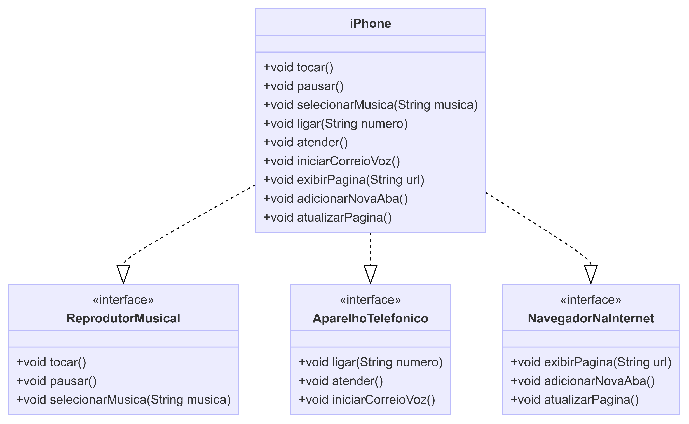

# Desafio POO - iPhone

Este projeto modela e implementa as funcionalidades básicas do iPhone de 2007, incluindo Reprodutor Musical, Aparelho Telefônico e Navegador na Internet.

## Estrutura do Projeto

- `ReprodutorMusical.java`: Interface para o reprodutor musical.
- `AparelhoTelefonico.java`: Interface para o aparelho telefônico.
- `NavegadorNaInternet.java`: Interface para o navegador na internet.
- `iPhone.java`: Classe que implementa todas as interfaces acima.

## Diagrama UML



## Como Compilar e Executar

1. Compile as classes Java:
   ```sh
   javac ReprodutorMusical.java AparelhoTelefonico.java NavegadorNaInternet.java iPhone.java
   ```

2. Execute a classe `iPhone`:
   ```sh
   java iPhone
   ```

## Funcionalidades

### Reprodutor Musical:
- `void tocar()`: Inicia a reprodução de uma música.
- `void pausar()`: Pausa a reprodução de uma música.
- `void selecionarMusica(String musica)`: Seleciona uma música específica para tocar.

### Aparelho Telefônico:
- `void ligar(String numero)`: Faz uma chamada para o número fornecido.
- `void atender()`: Atende uma chamada recebida.
- `void iniciarCorreioVoz()`: Inicia o correio de voz.

### Navegador na Internet:
- `void exibirPagina(String url)`: Exibe a página web fornecida pela URL.
- `void adicionarNovaAba()`: Adiciona uma nova aba no navegador.
- `void atualizarPagina()`: Atualiza a página atual do navegador.

## Exemplo de Uso

```java
public class Main {
    public static void main(String[] args) {
        iPhone meuIphone = new iPhone();

        // Testando ReprodutorMusical
        meuIphone.selecionarMusica("Imagine");
        meuIphone.tocar();
        meuIphone.pausar();

        // Testando AparelhoTelefonico
        meuIphone.ligar("123456789");
        meuIphone.atender();
        meuIphone.iniciarCorreioVoz();

        // Testando NavegadorNaInternet
        meuIphone.exibirPagina("https://www.example.com");
        meuIphone.adicionarNovaAba();
        meuIphone.atualizarPagina();
    }
}
```

## Contribuição

Contribuições são bem-vindas! Sinta-se à vontade para abrir issues ou enviar pull requests.

## Licença

Este projeto está licenciado sob a Licença MIT. Veja o arquivo [LICENSE](LICENSE) para mais detalhes.
```

### Passos para Adicionar o README.md ao seu Repositório

1. Crie um arquivo chamado `README.md` no diretório raiz do seu projeto.
2. Copie e cole o conteúdo acima no arquivo `README.md`.
3. Adicione o diagrama UML (uma imagem do diagrama que você criou) no repositório e ajuste o link da imagem no README.md, se necessário.
4. Faça commit e push do arquivo README.md para o seu repositório GitHub.

### Estrutura do Repositório

A estrutura do repositório deve ser algo como:

```
desafios/
├── poo/
│   ├── ReprodutorMusical.java
│   ├── AparelhoTelefonico.java
│   ├── NavegadorNaInternet.java
│   ├── iPhone.java
│   ├── diagrama_uml.png
│   └── README.md
```

Certifique-se de que todos os arquivos estão no local correto e referenciados corretamente no README.md.
